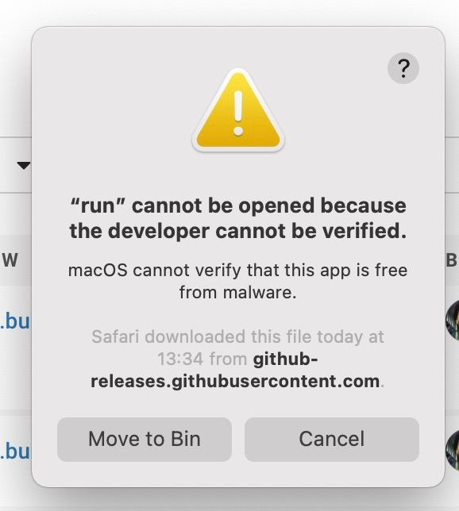
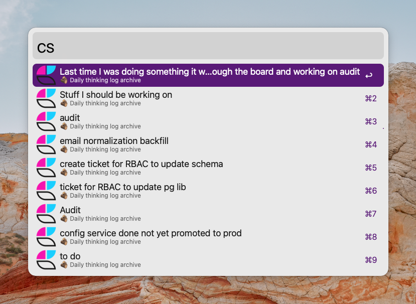
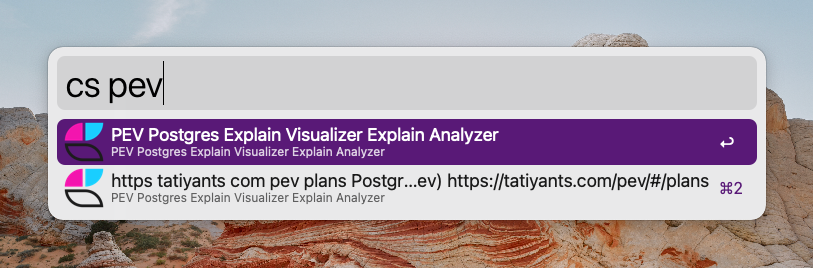

# CraftDocs Workflow

Search in Craft document with Craft Search Index.

## Install
Download
[the latest release](https://github.com/kudrykv/alfred-craftdocs-searchindex/releases/tag/v0.1.0),
double-click it and proceed with Alfred instructions.
Use `amd64` for Intel chips and `arm64` for M1 chips.

## Authorization
The first time you use the workflow after install or update, you will see the security warning:

This is a quirk of MacOS 10.15 and above.

After seeing this warning, you have to go to
`System Preferences > Security & Privacy > General`
and click the new button that has appeared to allow the executable to run.
You then have to run it again, and you will see this security warning again,
but now it will have a new button that lets you allow the executable to run.

## Search
Run `cs <query>` to look for documents.
It opens the page with the result.

